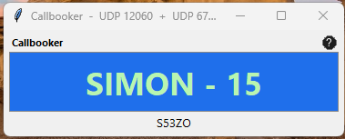
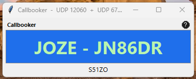
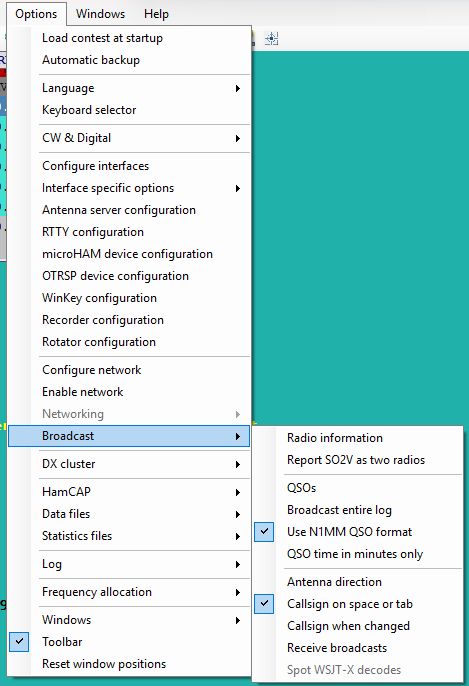

# Callbooker – contest callbook for HF and VHF

> **Version:** 1.3 · Made by **S55OO** with AI assistance.
> · **Public domain** – see [LICENSE](LICENSE).

A compact always-on-top window that listens to your logger's UDP broadcast
and looks up the callsign you are working. **Every source is queried in
parallel** and **all** of its values are shown side by side, so when the
sources disagree the wrong one stands out and you pick the right value for
the exchange. When they all agree the row collapses to a single value in a
larger green font – a quick "you can trust this".

It listens on **two feeds at once** and picks the right view per callsign:

- a callsign from **VHFCtest4WIN** (its sharing broadcast, UDP **6767**,
  sent as you type) → the **VHF** view: first name + each source's
  **QRA/maidenhead locator** (`Hans - JN76HD`);
- a callsign from **N1MM Logger+** or **DXLog.net** (UDP **12060**) → the
  **operating frequency** decides: **≥ 30 MHz → VHF**, **< 30 MHz → HF** (first name +
  **CQ zone**, plus the **US state** for North-American calls –
  `Fred - MA/5`).

So one window covers an HF station, a VHF station, and VHFCtest4WIN's
pre-log check – no switching apps or modes.

| HF view (first name + CQ zone) | VHF view (first name + locator) |
|---|---|
|  |  |

Both shots show the collapsed all-agree state – every source returned the
same value, so the row is a single larger green token.

### Sources

| Source | Free? | What it gives |
|---|---|---|
| **QRZ.com** | login optional | the paid [XML API](https://www.qrz.com/page/xml_data.html) (full record incl. grid, state, CQ zone) when a QRZ login is configured and the subscription is live; otherwise the public `/db/` page for the **locator only**. **One column either way** – qrz.com is never queried twice. |
| **[QRZCQ.com](https://www.qrzcq.com)** | yes, no account | name, locator, US state, CQ zone from `qrzcq.com/call/<CALL>` |
| **[HamQTH.com](https://www.hamqth.com)** | yes, no account | name, locator, country from `hamqth.com/<CALL>` |

The QRZ column is always shown in the VHF view (the public page still
yields the locator with no login); in the HF view it appears only when
QRZ credentials are configured.

The UI follows the same design language as the **PingPong** lamp: a small
topmost Tkinter window with a colored canvas and a help icon.

---

## 1. Logger setup

### N1MM Logger+

1. **File → Settings → Configurer → Broadcast Data** (a.k.a. External
   Broadcast), enable:
   - **External Callsign Lookup** – sends a `LookupInfo` packet after you
     type a callsign and press **Space** (moving to the exchange field).
     This is the primary trigger.
   - **Contacts** – sends a `ContactInfo` packet when a QSO is logged.
2. Set the **IP:Port** to your PC's address (or the subnet broadcast) and
   port **12060**.
3. Make sure **Broadcast Data is enabled** on the transmitting computer.

Callbooker listens on all interfaces and picks the worked callsign out of
the `LookupInfo` / `ContactInfo` packet. It ignores the local operator's
own call in `RadioInfo`, but **does** read the **frequency** from it as a
fallback for the HF/VHF decision.

### DXLog.net

DXLog.net can send the same `LookupInfo` / `ContactInfo` XML on 12060, so
Callbooker needs no extra setup once it is switched on. Under
**Options → Broadcast** tick:

- **Use N1MM QSO format** – the packet layout Callbooker parses.
- **Callsign on space or tab** – sends a `LookupInfo` packet when you
  press Space/Tab off the callsign field, *before* the QSO is logged.
  This is the pre-log trigger, same role as N1MM's *External Callsign
  Lookup*.
- **QSOs** – optional; adds a `ContactInfo` packet when a QSO is logged.



The broadcast target defaults to `127.0.0.1:12060`
(`Network_QSOsBroadcastPort` in DXLog's config) – leave it as is when
Callbooker runs on the same PC. Verified against DXLog.net v2.6.34.

### Which view — HF or VHF?

- A callsign from **VHFCtest4WIN** (6767) → **VHF** always.
- A callsign from **N1MM / DXLog.net** → by the **frequency**: it is in the
  `LookupInfo` / `ContactInfo` packet (`rxfreq` / `txfreq`), and Callbooker also
  tracks the last `RadioInfo` frequency as a fallback. **≥ 30 MHz → VHF**
  (locators), **< 30 MHz → HF** (name / zone / state).
- With **no frequency** seen yet, Callbooker opens in the **view it was
  last using** (remembered between runs; HF on a first run).

The country is never appended after the name in either view – the CQ zone
is the multiplier that matters and the name stays short.

### The VHFCtest4WIN feed (6767)

**VHFCtest4WIN** (S52AA's VHF contest logger) does not send N1MM
`LookupInfo` packets. Instead it broadcasts the callsign in its entry
field on its **multi-op sharing broadcast** (UDP **6767**) **as it is
typed**. Callbooker listens on 6767 **in addition to** the N1MM port, so
with VHFCtest4WIN the lookup runs *before* the QSO is logged and a wrong
QRA locator can be caught while it is still editable. The feed is **on by
default**; set `vhfctest_share=no` in `Callbooker.cfg` to turn it (and the
UAC prompt below) off.

- Nothing to switch on in VHFCtest4WIN – it already broadcasts its entry
  field on 6767 as part of normal network sharing.
- **Port 6767 / UAC.** VHFCtest4WIN keeps 6767 open with an exclusive
  lock, so the only way to read the broadcast while it runs is a raw
  capture socket, which needs elevation. When VHFCtest4WIN is already up,
  Callbooker **relaunches itself elevated** – one **UAC prompt, click
  Yes**. Decline it and the window still opens (N1MM feed only) and tells
  you what to do. No prompt when VHFCtest4WIN is not running yet, or when
  the 6767 feed is disabled.
- Start VHFCtest4WIN **first**, then Callbooker – the other way round on
  the same PC would take 6767 and break VHFCtest4WIN's own network
  sharing.
- **Multi-op:** VHFCtest4WIN broadcasts to the whole network, so every PC
  sees every operator's typing. Callbooker ignores everything except
  **its own PC's** VHFCtest4WIN, so each position's window follows only
  that operator (same local-computer-only rule as the N1MM feed).
- On another PC on the multi-op network, an ordinary listener works with
  no prompt.

### LAN cache sharing (6768)

In a multi-op or multi-PC setup, every Callbooker on the LAN **shares the
callsigns it looks up** on a dedicated broadcast port (**UDP 6768**), so
each call is fetched from QRZ / QRZCQ / HamQTH **once for the whole
network** and every other position gets it instantly.

- **On by default.** `lan_share=no` in `Callbooker.cfg` turns it off;
  `lan_share_port=` moves it.
- On a local cache miss Callbooker asks the LAN first and only queries the
  callbook sites if no peer answers within ~50 ms — imperceptible, and a
  LAN hit is as fast as its own cache.
- On start-up it asks every peer to replay their cache, so a PC that joins
  mid-contest catches up in a few seconds.
- Only the **displayed fields** go on the wire — the same data already in
  `Callbooker_cache.json`. **No QRZ login or session key is ever
  broadcast.**
- **First run may show a Windows Firewall prompt for port 6768 — allow it
  for Private networks** (same as the 6767 / 12060 listeners). On a
  *Public* network profile inbound is blocked by default and peers' data
  silently won't arrive.
- It is isolated from the loggers' own 12060 network — see
  `dev/lan-cache-sharing.md` for why a dedicated port.

---

## 2. Running

```
        double-click:  Callbooker.exe      (standalone, no Python needed)
   or:  run:  pythonw Callbooker.py        (from source, no console window)
```

`Callbooker.exe` prompts for **UAC** once when VHFCtest4WIN is already
running (see section 1).

Arguments:

```
python Callbooker.py [--port 12060] [--config Callbooker.cfg]
```

- `--port` – N1MM / DXLog.net UDP port (default 12060).
- `--config` – path to the config file (defaults to `Callbooker.cfg` next
  to the exe/script).

---

## 3. Configuration

`Callbooker.cfg` next to the exe – **optional**, the app runs with
defaults when it is absent. Copy `Callbooker.cfg.template` and edit:

```
[settings]
udp_port=12060
cache_days=30
cache_file=Callbooker_cache.json
cache_persist=yes                 # no = in-memory only, never writes to disk

# Start-up self-test (query every source once on launch, show OK / time):
# selftest=yes
# selftest_call=S55OO             # call to probe; blank / selftest=no disables

# QRZ.com login - the QRZ column uses the paid XML API when this is set
# and the subscription is live, otherwise the public page (locator only):
# qrz_username=S55OO
# qrz_password=YOUR_QRZ_PASSWORD

# VHFCtest4WIN pre-log feed, UDP 6767 (see section 1). On by default;
# set no to turn it - and the UAC prompt - off:
# vhfctest_share=no
# vhfctest_port=6767

# LAN cache sharing, UDP 6768 (see section 1). On by default; every
# Callbooker on the LAN shares resolved callsigns so each is fetched
# from the callbook sites only once for the whole network:
# lan_share=no
# lan_share_port=6768
```

There is **no HF/VHF-mode key** – Callbooker picks the view from the
frequency and remembers the last one between runs.

- `Callbooker.cfg` and its `cache_file` are read/written from the folder
  the exe/script lives in. Callbooker also writes `Callbooker_window.json`
  (last window position **and** last view) and `qrz_session.json` (the
  QRZ XML session key, so a restart skips the ~0.6 s re-login) – both are
  safe to delete and are gitignored.
- **`Callbooker.cfg` is gitignored** – it holds your QRZ login in plain
  text, so it is never committed. Only `Callbooker.cfg.template` (with a
  placeholder password) is in the repo.
- The `.exe` does **not** embed the `.cfg`; it reads it from disk at run
  time, so shipping the EXE never leaks your password.

### MQTT output (optional)

Callbooker can publish one JSON document after each completed lookup,
including cache hits. MQTT runs on its own network thread, reconnects in
the background, and **never blocks the lookup window** when the broker is
unavailable (results are held in a bounded offline queue). It is **off by
default**. Add this to `Callbooker.cfg` to enable it:

```ini
mqtt_enabled=yes
mqtt_server=192.168.1.10
mqtt_tls=yes
mqtt_port=8883
mqtt_topic=callbooker/results
# mqtt_qos may be 0, 1, or 2
mqtt_qos=1
mqtt_retain=no
# Blank client ID = random callbooker-XXXXXXXX each run
# mqtt_client_id=
# mqtt_username=
# mqtt_password=
# mqtt_password_env=CALLBOOKER_MQTT_PASSWORD
```

- **TLS** (`mqtt_tls=yes`) defaults to port 8883. `mqtt_ca_certs` may
  point to a custom CA file (relative paths resolve next to the config
  file); blank uses the OS CA store. `mqtt_tls_insecure=yes` disables
  certificate verification – diagnostic use only.
- Username/password **without** TLS sends credentials unencrypted, so use
  `mqtt_tls=yes` outside a trusted LAN. Prefer `mqtt_password_env` (names
  an environment variable) over a plaintext `mqtt_password`; either way it
  lives only in the gitignored local config, like the QRZ login.
- The publish topic is fixed and must not contain `+` or `#`.
- A blank/omitted `mqtt_client_id` uses a random `callbooker-XXXXXXXX`
  each launch so multiple stations don't collide; set it only if the
  broker needs a stable identity.
- Tuning (defaults): `mqtt_keepalive=60`, `mqtt_queue_max=100` (max
  1000), `mqtt_reconnect_min=1`, `mqtt_reconnect_max=30`.
- **From source**, install the dependency: `pip install -r
  requirements.txt`. The Windows `Callbooker.exe` already bundles it.
- Broker errors show in the footer beside the current callsign and clear
  on reconnect.

Each payload is **schema version 1**: `callsign`, `mode`, `feed`,
`frequency_mhz`, `cached`, a normalized `summary`, and the ordered
`sources` array (each with its source name, display value, and result
fields `name` / `grid` / `state` / `cqzone` / `country`; a failed source
has a `null` result). For N1MM the frequency is from the packet or the
last `RadioInfo`; it is `null` for VHFCtest4WIN.

```json
{
  "schema_version": 1,
  "published_at": "2026-09-02T18:30:00Z",
  "callsign": "S55OO",
  "mode": "vhf",
  "feed": "vhfctest4win",
  "frequency_mhz": null,
  "cached": false,
  "summary": {"name": "Goran", "values": ["JN76HD"], "agreement": false, "selected_value": null},
  "sources": [
    {"source": "QRZCQ", "value": "JN76HD", "result": {"name": "Goran", "grid": "JN76HD", "state": "", "cqzone": "15", "country": "Slovenia"}}
  ]
}
```

---

## 4. Behavior

- When a `LookupInfo` (call + Space) or `ContactInfo` (QSO logged) packet
  arrives, the window shows the worked callsign in the footer
  **immediately** and starts the lookup. **All sources are queried in
  parallel** and **each slot fills the moment that source answers** – `…`
  marks a slot still running. You might see `FRED - MA/5 … …` first, then
  the rest fill in.
- **When every source that answered agrees**, the text turns light green
  **and the repeated token collapses to one** – `FRED - MA/5 MA/5 MA/5`
  shows as **`FRED - MA/5`**. A disagreement (`FRED - MA/5 MA/4 MA/5`), or
  a source that returned only part (`MA` vs `MA/5`), keeps every slot
  visible so the odd one out is obvious.
- **The font is as large as the line allows** – measured, not guessed:
  the collapsed token, a `name - zone` DX line and a short two-source
  disagreement all get the big font; a long side-by-side row steps down
  until it fits the window.
- The **name** is the operator's **first word only** (`Goran Andric` →
  `Goran`, `ARRL HQ OPERATORS CLUB` → `ARRL`), printed once in front.
- **HF view:** `first name - state/zone` per source. A slot shows just
  the state when that source has no CQ zone, just the zone for a non-US
  station, or `·` when it returned neither.
- **VHF view:** `first name - locator` per source, separated by ` - `.
- **Local computer only:** the app only reacts to packets from *this* PC
  (identified by its local interface IPs), so only the local operator's
  callsign triggers a lookup.
- **Cache** (`Callbooker_cache.json`): a re-worked call resolves instantly
  and the servers aren't hit twice. Written **at most once a minute** (and
  once on close), stores only the displayed fields, prunes expired entries
  on load. `cache_days` (default 30) is the freshness window;
  `cache_persist=no` keeps it in memory only. The cache carries a schema
  version, so after an upgrade that changes the stored shape older entries
  re-fetch automatically.
- If the lookup fails the main area shows `lookup failed`; a callsign with
  no record shows `no data`.
- **Start-up self-test.** On launch, before the first callsign, each
  source is queried once and the window lists them one per line with the
  result and round-trip time:

  ```
  QRZ·xml OK       521 ms
  QRZCQ   OK       152 ms
  HamQTH  OK       236 ms
  ```

  `OK` = answered and parsed · `no data` = reachable, no record for the
  test call · `FAIL` = network/HTTP error. The **QRZ** line shows which
  path it took – `QRZ·xml` (paid API) or `QRZ·web` (public-page
  fall-back) – and the footer summary adds the subscription expiry, e.g.
  `self-test: 3/3 sources OK · QRZ XML sub to 2027`. All-green when every
  source is `OK`. Holds a few seconds, then the window goes idle (the
  footer summary stays until the first lookup). Test callsign defaults to
  **S55OO**; set `selftest_call=` to another, or `selftest=no` to skip.
- **Fast lookups:** one kept-alive HTTPS connection per host, gzip'd
  responses – the ~90 ms TLS handshake isn't paid every QSO. Time to fill
  all slots is ~155 ms (median) in testing.
- The small **help icon** (top-right) opens the project page in your
  browser.

---

## 5. Building the standalone EXE (for PCs without Python)

Requires Python + PyInstaller + the runtime dependency (`paho-mqtt`, for
the optional MQTT output – bundled into the EXE):

```bat
python -m pip install -r requirements.txt pyinstaller
python -m PyInstaller --onefile --windowed --name Callbooker --manifest manifest.xml --hidden-import paho.mqtt.client Callbooker.py
copy /Y dist\Callbooker.exe Callbooker.exe
```

(or just `python -m PyInstaller Callbooker.spec` – the spec already
carries the `--manifest` and `--hidden-import`.)

`manifest.xml` makes the window use modern common controls. The result is
a single standalone EXE (no Python required) – copy it to the other
computers together with the (optional) `Callbooker.cfg`.

---

## 6. Files

```
Callbooker.py           – the app (feeds, HF/VHF view switch, UAC self-relaunch)
Callbooker.exe          – standalone executable (built, no Python needed)
Callbooker.cfg.template – config template (copy to Callbooker.cfg, drop .template)
Callbooker.cfg          – live config (gitignored; holds the QRZ login in plain text)
n1mm_callbook.py        – the engine: CallbookApp window, run(), the source functions
mqtt_client.py          – optional reconnecting MQTT publisher (paho-mqtt)
requirements.txt        – Python runtime dependency (paho-mqtt)
Callbooker.spec         – PyInstaller build settings
manifest.xml            – PyInstaller manifest (common controls)
Callbooker_cache.json   – local lookup cache          (auto-created, gitignored)
Callbooker_window.json  – last window position + view (auto-created, gitignored)
qrz_session.json        – cached QRZ XML session key   (auto-created, gitignored)
LICENSE                 – The Unlicense (public domain)
CLAUDE.md               – developer notes (architecture, gotchas, release steps)
docs/*.png              – screenshots used in this README
dev/test_render.py      – headless display-logic tests (no network)
dev/test_lan_share.py   – headless LAN cache-sharing tests (no sockets)
dev/test_mqtt.py        – MQTT config/payload tests (no broker required)
dev/bench_latency.py    – lookup-latency benchmark
dev/*.py, dev/*.md      – logger-feed / VHFCtest4WIN notes and sniff tools
```

---

## 7. Changelog

Callbooker replaces the earlier separate apps (`n1mm_callbook` for HF,
`VHFcallbook` for VHF, and before that `n1mm_VHFcallbook` /
`VHFctest4WinCallbook`). All of their features are in `Callbooker` 1.3.

- **1.3** – optional **MQTT output**: one schema-versioned JSON document
  published after every completed lookup (cache hits included), with
  configurable broker, topic, QoS, retain, authentication, TLS, reconnect
  timing and a bounded offline queue. It runs on its own network thread
  and never blocks the lookup window; broker errors show in the footer.
  Off by default (`mqtt_enabled=yes` to turn on). `paho-mqtt` is bundled
  into `Callbooker.exe`; from source, `pip install -r requirements.txt`.
  Contributed by S53ZO.
- **1.2** – **LAN cache sharing** (UDP 6768, on by default). Every
  Callbooker on the LAN shares the callsigns it resolves, so in a
  multi-op each call is fetched from QRZ / QRZCQ / HamQTH **once for the
  whole network**. On a local cache miss Callbooker asks the LAN first
  and only queries the websites if no peer answers within ~50 ms; on
  start-up it pulls every peer's cache. Only the displayed fields go on
  the wire — never a QRZ login. Dedicated port, isolated from the
  loggers' own 12060 network (`dev/lan-cache-sharing.md`). Also documents
  DXLog.net (works on 12060 with no code change) and adds a dev note on
  adding further loggers.
- **1.1** – single-app release. One window, two feeds (N1MM 12060 +
  VHFCtest4WIN 6767), HF/VHF view chosen per callsign from the operating
  frequency (`rxfreq` in the packet, or the last `RadioInfo`), remembered
  between runs. QRZ is one column (paid XML API when the login/subscription
  works, else the public page for the locator – never queried twice), and
  the self-test shows which path it took. Agreed values collapse to one
  larger green token; the result line is drawn at the biggest font that
  fits. Names are trimmed to the first word; no country after the name.
  Public domain.

---

## 8. License

Released into the **public domain** under [The Unlicense](LICENSE) – do
whatever you want with it, no attribution required.

The standalone EXE bundles the Python runtime and Tcl/Tk, which keep their
own permissive licenses (PSF and BSD-style); PyInstaller's bootloader
carries an explicit exception that allows shipping the frozen app under
any license.
