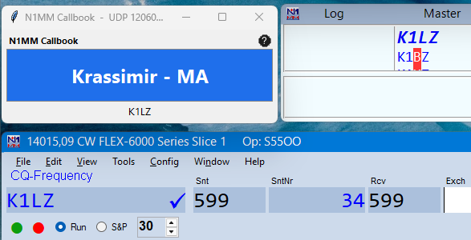

# N1MM Callbook – N1MM Logger+ Contest Callbook

> **Version:** 2.8 (HF) / 1.12 (VHF) · Made by **S55OO** with AI assistance.
> · **Public domain** – see [LICENSE](LICENSE).

A compact always-on-top window that listens to the N1MM Logger+ external
UDP broadcast (XML, port **12060**) and automatically looks up the callsign
you are working. Every source is queried **in parallel** and **all** of its
values are shown side by side – each slot filling in the moment that
source answers, so nothing waits for the slowest one – and when the
sources disagree the wrong one stands out and you can pick the right one.
The window shows the worked station's **name**, then each source's
**US state and CQ zone** as one `state/zone` token, and the **callsign**
in the footer – e.g. `Fred - MA/5 MA/5 MA/5` (name printed once as the
shortest of the sources). For a **non-US (DX) station**, where there is no
US state, the HF window shows the **operator name and country** followed
by each source's **CQ zone**, e.g. `Hans (Germany) - 14 14 14`.

The HF callbook pulls its **state, CQ zone** and name from up to **three
sources**: **[QRZ.com XML](https://www.qrz.com/page/xml_data.html),
[QRZCQ.com](https://www.qrzcq.com) and
[HamQTH.com](https://www.hamqth.com)**. They are queried at the same time;
the slots are shown left-to-right in that order (QRZ XML left-most when
your QRZ login is configured). Without QRZ credentials it runs the two
free sources.

A **VHF variant** (`n1mm_VHFcallbook.py` / `n1mm_VHFcallbook.exe`) is also
included. It uses the same engine but shows the worked station's
**QRA/maidenhead locator** (e.g. `JN76HD`) in the main area, from the
sources shown side by side – handy for VHF/UHF contests where the grid
square is the exchange. The **locator sources**:

| Source | How the locator is read |
|---|---|
| QRZCQ.com | `Grid:` / `Locator:` row on `https://www.qrzcq.com/call/<CALL>` |
| HamQTH.com | `Grid:` row on `https://www.hamqth.com/<CALL>` |
| QRZ.com | computed from the station coordinates embedded in the public `https://www.qrz.com/db/<CALL>` page ("Grid square" in the Detail tab) |

All locator sources are queried **in parallel** and each slot fills as
soon as that source replies. With QRZ credentials configured the QRZ XML
service is added as the left-most slot; without credentials the VHF app
uses the three free locator sources.

QRZCQ.com is a free public callbook that needs **no account and no API key** –
each callsign has a page at `https://www.qrzcq.com/call/<CALL>` whose lookup
info this app reads.

The UI follows the same design language as the **PingPong** lamp: a small
topmost Tkinter window with a colored canvas and a help icon.

---

## Screenshot



---

## 1. N1MM Logger+ setup

1. In N1MM Logger+: **File → Settings → Configurer → Broadcast Data**
   (a.k.a. External Broadcast), enable:
   - **External Callsign Lookup** – sends a `LookupInfo` packet after you
     type a callsign and press **Space** (i.e. as you move to the exchange
     field). This is the primary trigger for the callbook.
   - **Contacts** – sends a `ContactInfo` packet when a QSO is logged.
2. Set the **IP:Port** next to them to your PC's address (or the subnet
   broadcast) and port **12060**.
3. Make sure **Broadcast Data is enabled** on the transmitting computer.

> The app listens on all interfaces and picks the worked callsign out of
> the `LookupInfo`/`ContactInfo` packet automatically. `RadioInfo` only
> carries the local operator's own call and is deliberately ignored.

---

## 2. Running

HF callbook:

```
        double-click:  Callbook.bat       (from source, no console)
   or:  run:  pythonw n1mm_callbook.py    (from source, no window)
   or:  run:  n1mm_callbook.exe           (standalone executable)
```

VHF locator variant:

```
   or:  run:  pythonw n1mm_VHFcallbook.py (from source, no window)
   or:  run:  n1mm_VHFcallbook.exe        (standalone executable)
```

Arguments:

```
python n1mm_callbook.py [--port 12060] [--config callbook.cfg]
python n1mm_VHFcallbook.py [--port 12060] [--config n1mm_VHFcallbook.cfg]
```

- `--port` – UDP port (default 12060).
- `--config` – path to the matching `.cfg` file.

> Both apps can run at the same time (e.g. one on each radio or monitor).
> They share the local-computer-only filtering and each keep their own
> cache file, so they never interfere with each other.

---

## 3. Behavior

- When a `LookupInfo` (type a call + press Space) or `ContactInfo` (QSO
  logged) packet arrives, the window shows the worked callsign in the
  footer **immediately** and starts the lookup. **All sources are queried
  in parallel** and **each slot's value is shown the moment that source
  answers** – `…` marks a slot still running. A slow source never holds up
  a fast one: you might see `FRED - MA/5 … …` first, then the rest fill in
  to `FRED - MA/5 MA/5 MA/5`.
- The slots are laid out left-to-right in a fixed order –
  **QRZ.com XML, QRZCQ.com, HamQTH.com** (QRZ XML only when credentials are
  configured; the **VHF variant** adds **QRZ.com public page** as a fourth
  slot). The order is just the column layout, not a priority – every source
  is fetched at the same time. When the values differ (e.g.
  `MA/5 MA/4 MA/5`) you see it immediately and can decide which one is
  right for the exchange.
- For a **US station** the main area shows the **shortest operator name**
  (printed once) followed by one **`state/zone`** token per source, e.g.
  `FRED - MA/5 MA/5 MA/5`. A slot shows just the state when that source has
  no CQ zone (`MA`), just the zone for a DX-style entry, or `-` when it
  returned neither. The font shrinks automatically for long text.
- For a **non-US (DX) station** there is no US state, so the HF window
  shows the **operator name and country** followed by each source's **CQ
  zone**, e.g. `Hans (Germany) - 14 14 14` (or just `Hans (Germany)` when
  no source reports a zone). A foreign subdivision that QRZ XML sometimes
  returns in the state field (e.g. `HE` for a German call) is ignored; the
  CQ zone, which is meaningful worldwide, is kept.
- The **VHF variant** shows the **QRA/maidenhead locator** the same
  side-by-side way and has no name/DX handling – it only needs the grid.
- **Local computer only:** the app only reacts to packets sent from *this*
  PC (identified by its local interface IPs). Broadcasts from other
  stations on the network are ignored, so only the local operator's
  callsign triggers a lookup.
- Lookups are cached locally (`callbook_cache.json` for HF,
  `n1mm_VHFcallbook_cache.json` for VHF) to avoid repeated
  network fetches for the same callsign and to stay polite to the server.
- Cache freshness is controlled by `cache_days` in `callbook.cfg`
  (default 30 days). The cache also carries a schema version: after an
  upgrade that changes the stored result shape, older entries are
  re-fetched automatically the next time that call comes up. Deleting the
  cache file forces a full refresh.
- If the lookup fails the main area shows `lookup failed`; if a callsign
  has no entry it shows `no data`.
- The small **help icon** (top-right) opens the project page
  (`https://github.com/s55oo/N1MM_callbook/`) in your browser.

---

## 4. Configuration

`callbook.cfg` (HF) / `n1mm_VHFcallbook.cfg` (VHF). Both are optional; the
apps run with defaults when no `.cfg` exists. Templates are in the repo:
`callbook.cfg.template` and `n1mm_VHFcallbook.cfg.template`.

```
[settings]
udp_port=12060
cache_days=30
cache_file=callbook_cache.json           (VHF: n1mm_VHFcallbook_cache.json)

# Optional - paid QRZ.com XML service (extra state / locator slot):
# qrz_username=S55OO
# qrz_password=YOUR_QRZ_PASSWORD
```

- Each `.cfg` and its matching `cache_file` are read/written from the same
  folder as the executable/script.
- Both `.cfg` files are **gitignored** – they hold your QRZ login in
  **plain text**, so they are never committed and never land in a shared
  build. Only the `*.cfg.template` files (with placeholder credentials) are
  in the repo. Copy the matching template, fill in your QRZ credentials,
  and rename to `callbook.cfg` / `n1mm_VHFcallbook.cfg`.
- The built `.exe` files do **not** embed the `.cfg`; they read it from
  disk at run time, so shipping an EXE never leaks your password.

---

## 5. Building the standalone EXEs (for PCs without Python)

Requires Python + PyInstaller:

```bat
python -m pip install pyinstaller

REM HF callbook:
python -m PyInstaller --onefile --windowed --name n1mm_callbook --manifest manifest.xml n1mm_callbook.py
copy /Y dist\n1mm_callbook.exe n1mm_callbook.exe

REM VHF locator variant:
python -m PyInstaller --onefile --windowed --name n1mm_VHFcallbook --manifest manifest.xml n1mm_VHFcallbook.py
copy /Y dist\n1mm_VHFcallbook.exe n1mm_VHFcallbook.exe
```

`manifest.xml` makes the windows use modern common controls. The results are
single standalone EXEs (no Python required) – copy them to the other
computers together with the (optional) matching `.cfg`.

---

## 6. Files

```
n1mm_callbook.py     – main application, HF callbook (source code)
n1mm_callbook.exe    – HF standalone executable (built, no Python needed)
n1mm_VHFcallbook.py  – VHF locator variant (source code)
n1mm_VHFcallbook.exe – VHF standalone executable (built, no Python needed)
callbook.cfg.template     – HF config template (copy to callbook.cfg)
callbook.cfg              – HF config (gitignored; may hold QRZ login in plain text)
callbook_cache.json       – HF local lookup cache (auto-created, gitignored)
n1mm_VHFcallbook.cfg.template – VHF config template
n1mm_VHFcallbook.cfg      – VHF config (gitignored; may hold QRZ login in plain text)
n1mm_VHFcallbook_cache.json – VHF local lookup cache (auto-created, gitignored)
Callbook.bat         – source launcher (no console)
manifest.xml         – PyInstaller manifest (common controls)
n1mm_callbook.spec, n1mm_VHFcallbook.spec – PyInstaller build settings
dist\                – PyInstaller output
```

> QRZ.com XML needs a **paid subscription** for full records. Even without
> it, QRZ returns the US state (and a plain name/address) for a login, so
> the HF app still gets its three state sources (QRZ XML, QRZCQ, HamQTH);
> the VHF app's locators are all free (QRZCQ, HamQTH, QRZ public page).

---

## 7. Changelog

- **2.8 (HF) / 1.12 (VHF)** – fixed a hang where retyping a callsign while
  a lookup was still running could stop all further lookups until restart.
  Internal: the two apps now share one `run()`/`load_config()` entry point
  (`n1mm_VHFcallbook.py` is a ~30-line subclass); the VHF title bar now
  shows its own version instead of the HF one.
- **2.7 (HF) / 1.11 (VHF)** – the **?** icon now opens the project page on
  GitHub instead of QRZCQ.com; released into the **public domain** (The
  Unlicense).
- **2.6 (HF) / 1.10 (VHF)** – the cache now carries a schema version, so
  entries written by an older build are always re-fetched once after an
  upgrade (the 2.5 fix missed calls that a 2.4 build had already cached).
  Locators are also upper-cased on read, so even a stale entry displays
  consistently.
- **2.5 (HF) / 1.9 (VHF)** – VHF: locators are upper-cased on the way in
  (some sources return the sub-square lower case, e.g. `JN46la` vs
  `JN46LA`), so a pure case difference no longer looks like a source
  disagreement.
- **2.4 (HF) / 1.8 (VHF)** – HF now also looks up the **CQ zone** from
  every source and shows it next to the state as a `state/zone` token
  (e.g. `MA/5`); DX stations show the CQ zone after the country. Cache
  entries from an earlier version (no CQ zone stored) are refreshed
  automatically on next use. VHF display unchanged (shared engine update
  only).
- **2.3 (HF) / 1.7 (VHF)** – all sources are now queried **in parallel**;
  each slot fills as soon as that source answers instead of waiting for
  the whole chain. HF: **non-US (DX) stations** now show the operator
  **name and country** instead of `no data`; a foreign subdivision
  returned by QRZ XML in the state field is ignored.
- **2.2 (HF) / 1.6 (VHF)** – per-source side-by-side display; QRZ.com XML
  added as an optional source.

---

## 8. License

This project is released into the **public domain** under
[The Unlicense](LICENSE) – do whatever you want with it, no attribution
required.

The standalone EXEs bundle the Python runtime and Tcl/Tk, which keep
their own permissive licenses (PSF and BSD-style); PyInstaller's
bootloader carries an explicit exception that allows shipping the frozen
app under any license. Nothing in the toolchain restricts this
dedication.
